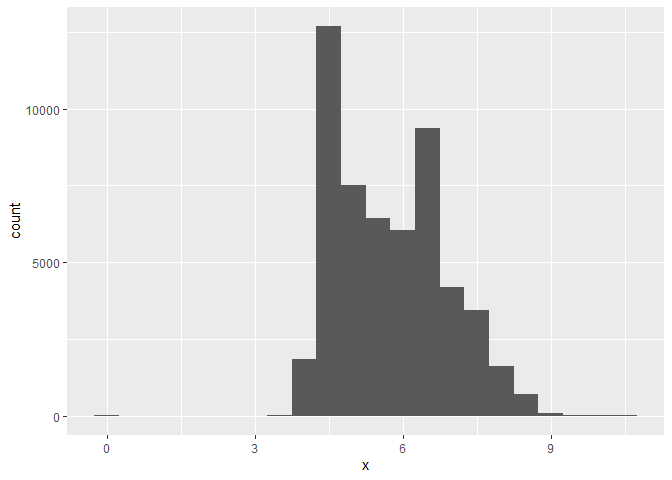
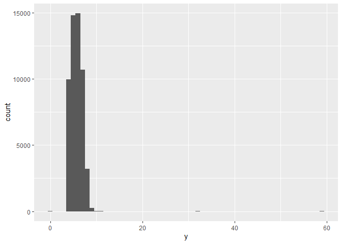
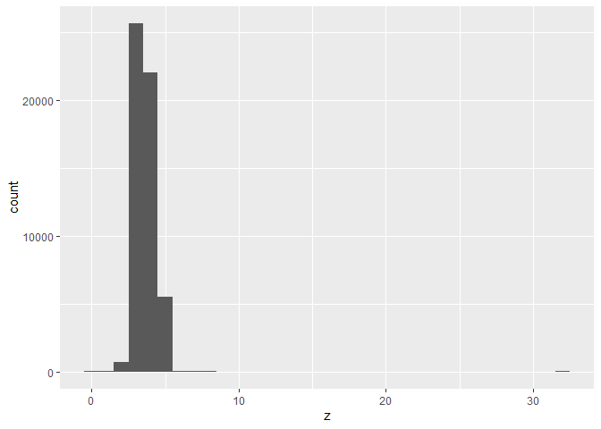
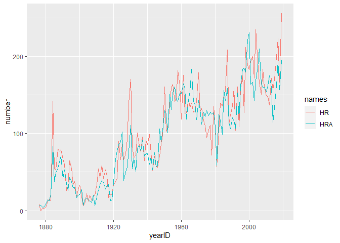

first rmarkdown
================
Tina
12/23/2020

This is a document that has some words and code in it.

# This is a section with some old hw

``` r
library(tidyverse)
```

I use `message = FALSE` in the library code chunk to not show the
messages that come with loading the library.

``` r
#This is a part of a homework that I randomly copied from DS100.

ggplot(data = diamonds, aes(x = x)) +
  geom_histogram(binwidth = 0.5)
```

<!-- -->

``` r
ggplot(data = diamonds, aes(x = y)) +
  geom_histogram(binwidth = 1)
```

<!-- -->

This is where I explain what the code does and interpret the results.

``` r
ggplot(data = diamonds, aes(x = z)) +
  geom_histogram(binwidth = 1)
```

<!-- -->

And then I do it again for another graph.

# Next section with other hw

This is from week 9.

``` r
library(tidyverse)
library(Lahman)
library(lubridate)
library(mosaicData)
```

``` r
Teams_long <- Teams %>%
  filter(teamID == "CHN") %>%
  select(yearID, teamID, HR, HRA) %>%
  pivot_longer(cols = c(HR, HRA),
               names_to = "names",
               values_to = "number")
ggplot(Teams_long, aes(x = yearID, y = number, color = names)) +
  geom_line()
```

<!-- -->
